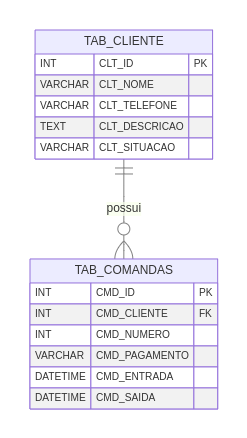

# Projeto Integrado Unifeob
<p align="left">
  
  
  
  
</p>

## Descrição
Este projeto é uma aplicação de portaria desenvolvida em C# utilizando o .NET Framework. A aplicação permite gerenciar clientes, comandas e relatórios. Evitando assim a ultilização de papeis no dia a dia do estabelecimento.

## Requisitos
- .NET 8.0 ou superior
- Banco de dados SQLite

## Uso
1. Clone o repositório:
    ```bash
    git clone <URL_DO_REPOSITORIO>
    ```
2. Entre na pasta `publish - portaria`
3. Rode o .exe `Portaria.exe`

## Banco de dados


## Instalação
1. Clone o repositório:
    ```bash
    git clone <URL_DO_REPOSITORIO>
    cd projeto-integrado-unifeob
    ```

2. Restaure as dependências do projeto:
    ```bash
    dotnet restore
    ```

3. Compile o projeto:
    ```bash
    dotnet build
    ```

## Uso
1. Execute a aplicação:
    ```bash
    dotnet run --project Portaria/Portaria.csproj
    ```

2. A aplicação será iniciada e você poderá gerenciar clientes, comandas e relatórios através da interface gráfica.

## Estrutura do Projeto
- `Portaria/`: Contém os arquivos principais da aplicação.
- `banco/`: Contém o banco de dados SQLite.
- `Resources/`: Contém os recursos de imagem utilizados na aplicação.

## Contribuição
1. Faça um fork do repositório.
2. Crie uma nova branch:
    ```bash
    git checkout -b minha-feature
    ```
3. Faça suas alterações e commit:
    ```bash
    git commit -m "Minha nova feature"
    ```
4. Envie para o repositório remoto:
    ```bash
    git push origin minha-feature
    ```
5. Abra um Pull Request.

## Licença
Este projeto está licenciado sob a licença MIT. Veja o arquivo [LICENSE](LICENSE) para mais detalhes.
